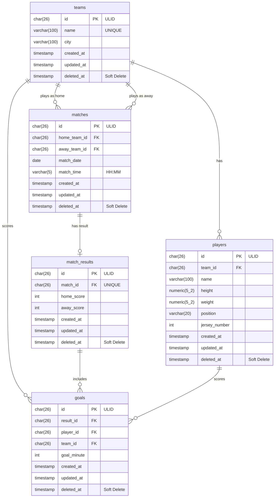

# Entity Relationship Diagram (ERD)

This document contains the Entity Relationship Diagram for the Football Management System, generated using Mermaid.

## Description of Entities

*   **`teams`**: Represents a football club.
*   **`players`**: Represents a football player who belongs to a `team`. A team cannot have two players with the same jersey number (enforced by a composite unique constraint).
*   **`matches`**: Represents a scheduled game between a home team and an away team.
*   **`match_results`**: Stores the final score of a `match`. It has a strict 1-to-1 relationship with `matches` (via a unique constraint on `match_id`).
*   **`goals`**: Records an individual goal scored during a match result. It points to the `match_result` it belongs to, the `player` who scored it, and the `team` the player scored for.
